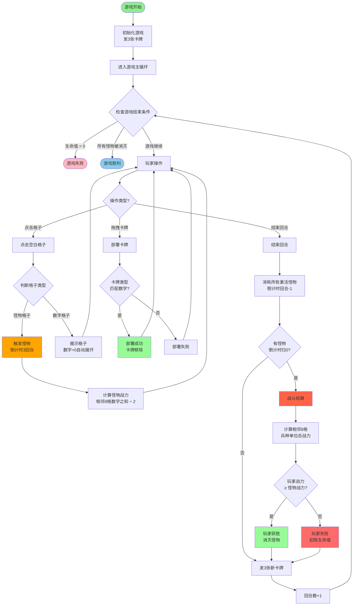
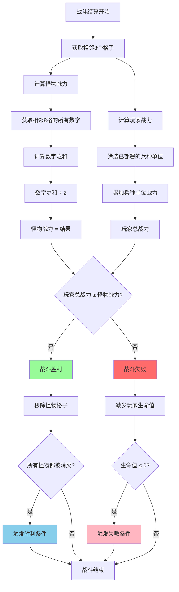
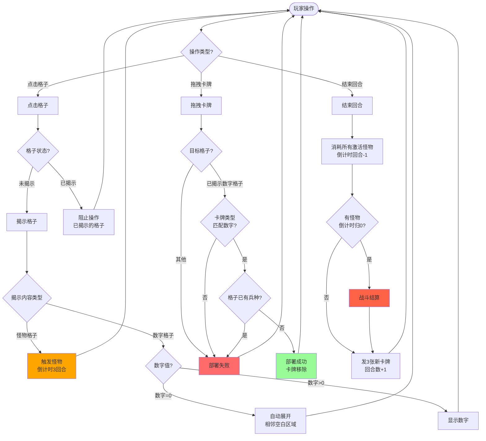
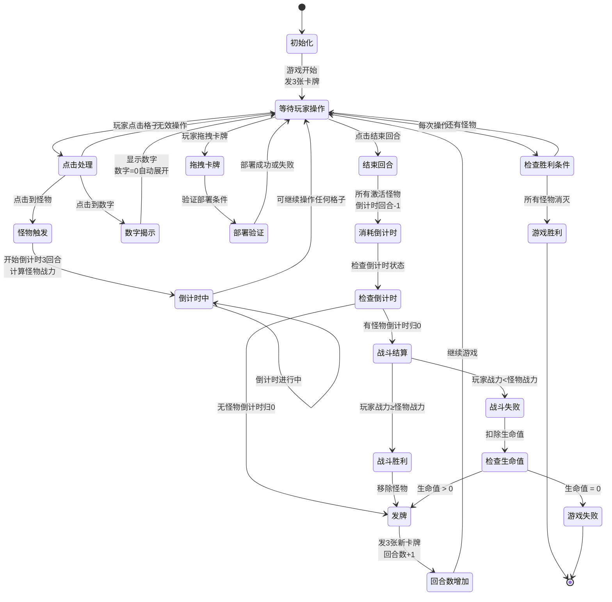

# 游戏流程图

## 设计说明

### 怪物战力计算规则

**怪物战斗力 = 相邻8个格子的数字之和 ÷ 2**

这个设计的目的：
1. **平衡性**：即使玩家没有完全揭露所有数字，仍然有机会战胜怪物（因为怪物战力是数字总和的一半，相对较低）
2. **策略性**：玩家在倒计时期间，可以主动揭露怪物相邻的格子，在数字格子上部署兵种来增加玩家战力
3. **风险与收益**：玩家需要在倒计时结束前，权衡是否值得消耗回合数去揭露更多格子并部署兵种

### 战斗机制说明

- **怪物战力**：基于相邻8格的所有数字（无论是否已揭示）之和的一半
- **玩家战力**：基于相邻8格中玩家已部署的兵种单位总战力
- **倒计时类型**：回合数倒计时（初始3回合），不是时间倒计时
- **倒计时消耗**：每次点击"结束回合"时，所有激活怪物的倒计时回合-1
- **倒计时期间**：玩家可以继续操作任何格子（没有位置限制）
- **战斗结算**：倒计时归0时，在下次"结束回合"时进行战斗结算

### 卡牌系统

- **发牌机制**：每回合结束时发3张随机卡牌
- **手牌上限**：手牌最大10张
- **部署规则**：卡牌类型必须与数字格子的数字匹配才能部署
- **兵种战力**：兵种战力 = 卡牌类型值（简化设计）

### 回合系统

- **回合流程**：玩家操作 → 点击"结束回合" → 消耗怪物倒计时 → 发新卡牌 → 回合数+1
- **操作类型**：点击格子（揭示）、拖拽卡牌（部署）、结束回合

## 核心游戏流程

## 战斗结算详细流程

## 玩家操作流程

## 游戏状态管理

