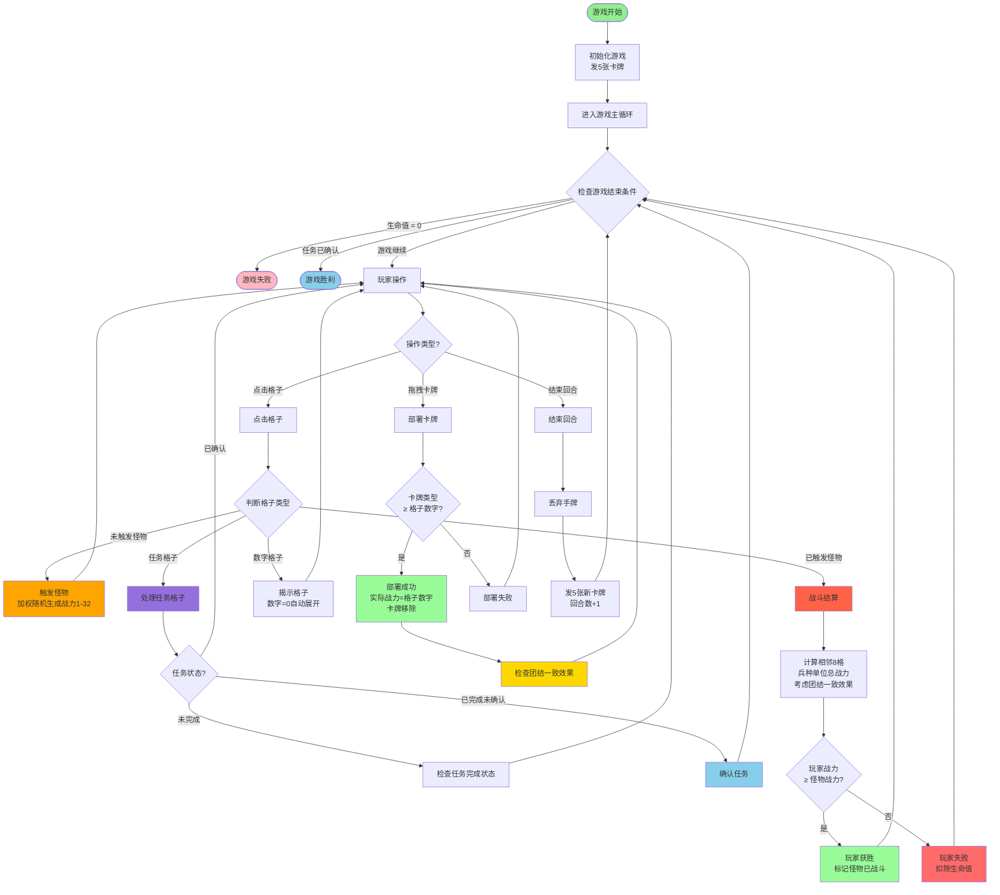

# 游戏流程图

## 设计说明

### 怪物战力计算规则

**怪物战斗力 = 使用加权随机生成（1-32，低数值权重更高）**

这个设计的目的：
1. **随机性**：增加游戏的随机性和挑战性，每次战斗都有不同的难度
2. **策略性**：玩家需要在怪物待机期间，合理部署兵种来应对随机生成的怪物战力
3. **风险与收益**：玩家需要权衡是否立即战斗，还是先准备更多战力

### 战斗机制说明

- **怪物战力**：使用加权随机生成（1-32），在触发时确定，低数值概率更高
- **玩家战力**：基于相邻8格中玩家已部署的兵种单位总战力（考虑团结一致效果）
- **触发机制**：点击怪物后进入待机状态，再次点击进行战斗结算
- **待机期间**：玩家可以继续操作任何格子（没有位置限制）
- **战斗结算**：再次点击待机状态的怪物时，立即进行战斗结算

### 卡牌系统

- **发牌机制**：每回合结束时发5张随机卡牌（低数值卡牌概率更高）
- **手牌上限**：手牌最大10张
- **部署规则**：卡牌类型必须 >= 数字格子的数字才能部署，实际战力 = 格子数字
- **兵种战力**：实际战力 = 格子数字（高数值卡牌会降低到格子数值）

### 回合系统

- **回合流程**：玩家操作 → 点击"结束回合" → 丢弃手牌并发新卡牌 → 回合数+1
- **操作类型**：点击格子（揭示/触发怪物/战斗/任务）、拖拽卡牌（部署）、结束回合

### 任务系统

- **任务类型**：探查周边、击败所有怪物、找到任务
- **任务完成**：自动检测任务完成状态，完成后需要再次点击任务格子确认
- **胜利条件**：完成任务并确认后游戏胜利

### 团结一致效果

- **触发条件**：当一行或一列有3个或以上战士（类型1）时
- **效果**：这些战士获得战力翻倍效果（1次翻倍=2倍，2次翻倍=4倍）
- **叠加**：如果战士同时满足行和列条件，可以获得2次效果（4倍战力）

## 核心游戏流程

