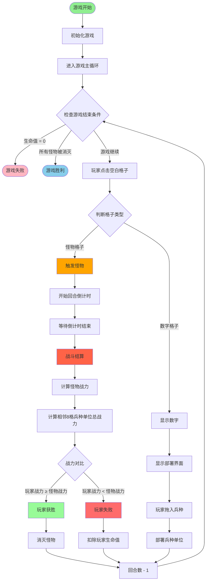
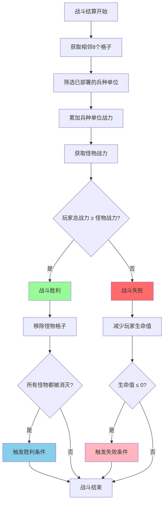
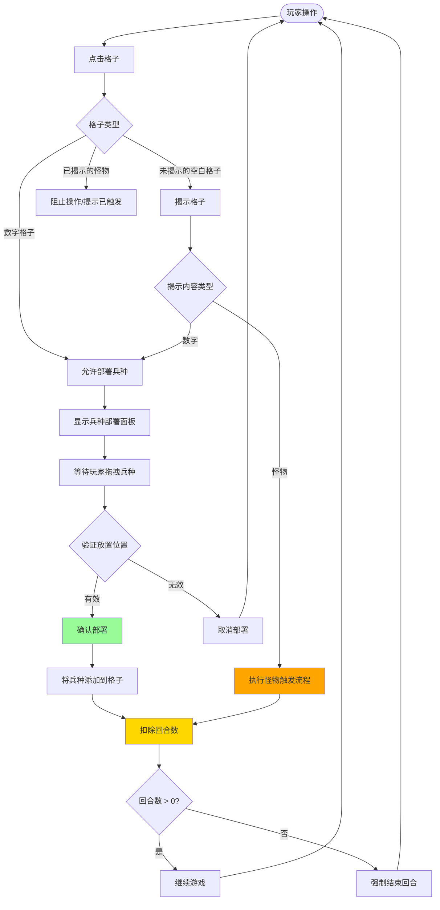
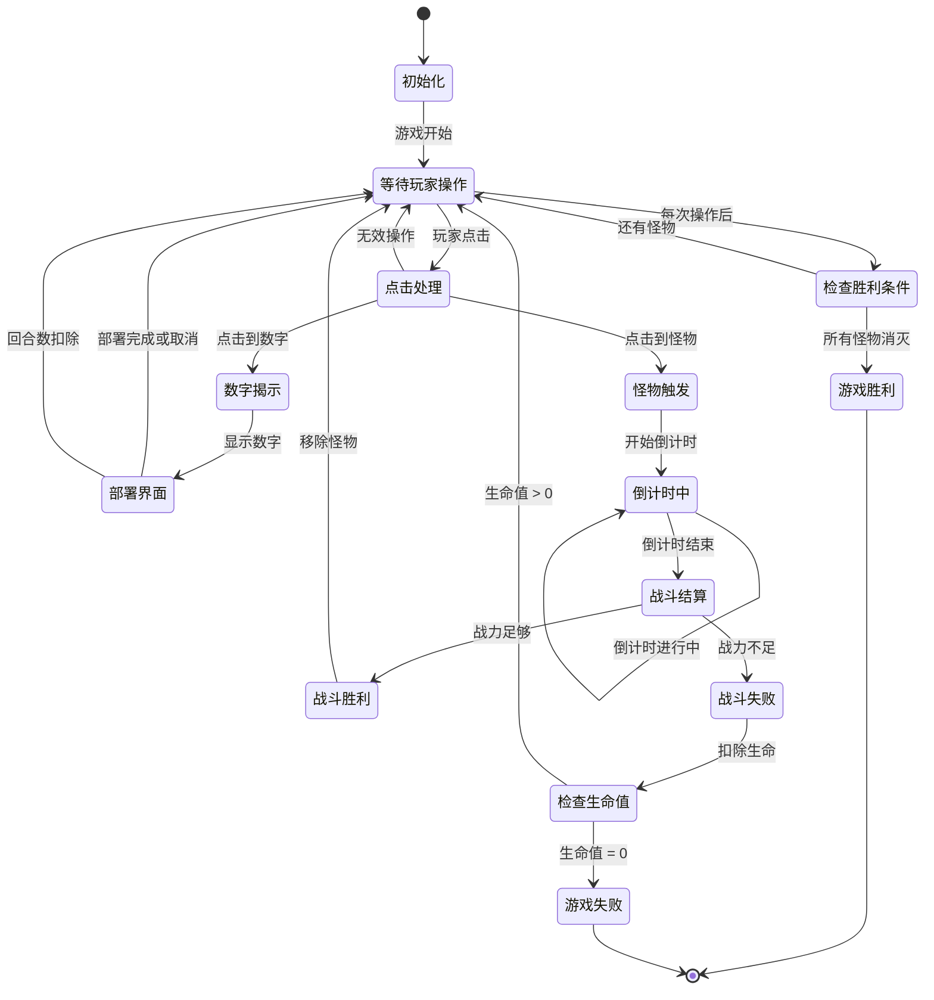

# 游戏流程图

## 核心游戏流程

```mermaid
flowchart TD
    Start([游戏开始]) --> InitGame[初始化游戏]
    InitGame --> GameLoop[进入游戏主循环]
    
    GameLoop --> CheckGameOver{检查游戏结束条件}
    
    CheckGameOver -->|生命值 = 0| GameFail([游戏失败])
    CheckGameOver -->|所有怪物被消灭| GameWin([游戏胜利])
    CheckGameOver -->|游戏继续| PlayerClick[玩家点击空白格子]
    
    PlayerClick --> CheckCellType{判断格子类型}
    
    CheckCellType -->|怪物格子| TriggerMonster[触发怪物]
    CheckCellType -->|数字格子| ShowNumber[显示数字]
    
    TriggerMonster --> StartCountdown[开始回合倒计时]
    StartCountdown --> WaitCountdown[等待倒计时结束]
    WaitCountdown --> BattleSettlement[战斗结算]
    
    BattleSettlement --> CalcMonsterPower[计算怪物战力]
    CalcMonsterPower --> CalcPlayerPower[计算相邻8格兵种单位总战力]
    CalcPlayerPower --> ComparePower{战力对比}
    
    ComparePower -->|玩家战力 ≥ 怪物战力| PlayerWin[玩家获胜]
    ComparePower -->|玩家战力 < 怪物战力| PlayerLose[玩家失败]
    
    PlayerWin --> DestroyMonster[消灭怪物]
    PlayerLose --> DeductHealth[扣除玩家生命值]
    
    DestroyMonster --> UpdateRound
    DeductHealth --> UpdateRound
    
    ShowNumber --> ShowDeployUI[显示部署界面]
    ShowDeployUI --> PlayerDrag[玩家拖入兵种]
    PlayerDrag --> DeployUnit[部署兵种单位]
    DeployUnit --> UpdateRound
    
    UpdateRound[回合数 - 1] --> CheckGameOver
    
    style Start fill:#90EE90
    style GameWin fill:#87CEEB
    style GameFail fill:#FFB6C1
    style TriggerMonster fill:#FFA500
    style BattleSettlement fill:#FF6347
    style PlayerWin fill:#98FB98
    style PlayerLose fill:#FF6B6B
```

## 战斗结算详细流程

```mermaid
flowchart TD
    BattleStart[战斗结算开始] --> GetAdjacentCells[获取相邻8个格子]
    GetAdjacentCells --> FilterDeployedUnits[筛选已部署的兵种单位]
    FilterDeployedUnits --> SumPlayerPower[累加兵种单位战力]
    SumPlayerPower --> GetMonsterPower[获取怪物战力]
    GetMonsterPower --> PowerCompare{玩家总战力 ≥ 怪物战力?}
    
    PowerCompare -->|是| Victory[战斗胜利]
    PowerCompare -->|否| Defeat[战斗失败]
    
    Victory --> RemoveMonster[移除怪物格子]
    RemoveMonster --> CheckAllMonsters{所有怪物都被消灭?}
    CheckAllMonsters -->|是| TriggerWin[触发胜利条件]
    CheckAllMonsters -->|否| BattleEnd[战斗结束]
    
    Defeat --> ReduceHealth[减少玩家生命值]
    ReduceHealth --> CheckHealth{生命值 ≤ 0?}
    CheckHealth -->|是| TriggerFail[触发失败条件]
    CheckHealth -->|否| BattleEnd
    
    TriggerWin --> BattleEnd
    TriggerFail --> BattleEnd
    
    style Victory fill:#98FB98
    style Defeat fill:#FF6B6B
    style TriggerWin fill:#87CEEB
    style TriggerFail fill:#FFB6C1
```

## 玩家操作流程

```mermaid
flowchart TD
    PlayerAction([玩家操作]) --> ClickCell[点击格子]
    ClickCell --> CellType{格子类型}
    
    CellType -->|未揭示的空白格子| Reveal[揭示格子]
    CellType -->|数字格子| AllowDeploy[允许部署兵种]
    CellType -->|已揭示的怪物| BlockAction[阻止操作/提示已触发]
    
    Reveal --> RevealType{揭示内容类型}
    RevealType -->|怪物| TriggerMonsterFlow[执行怪物触发流程]
    RevealType -->|数字| AllowDeploy
    
    AllowDeploy --> ShowDeployPanel[显示兵种部署面板]
    ShowDeployPanel --> WaitDrag[等待玩家拖拽兵种]
    WaitDrag --> ValidateDrop{验证放置位置}
    
    ValidateDrop -->|有效| ConfirmDeploy[确认部署]
    ValidateDrop -->|无效| CancelDeploy[取消部署]
    
    ConfirmDeploy --> AddUnitToCell[将兵种添加到格子]
    AddUnitToCell --> DeductRound[扣除回合数]
    
    TriggerMonsterFlow --> DeductRound
    CancelDeploy --> PlayerAction
    
    DeductRound --> CheckRound{回合数 > 0?}
    CheckRound -->|是| ContinueGame[继续游戏]
    CheckRound -->|否| ForceEndTurn[强制结束回合]
    
    ContinueGame --> PlayerAction
    ForceEndTurn --> PlayerAction
    
    style TriggerMonsterFlow fill:#FFA500
    style ConfirmDeploy fill:#98FB98
    style DeductRound fill:#FFD700
```

## 游戏状态管理

```mermaid
stateDiagram-v2
    [*] --> 初始化
    
    初始化 --> 等待玩家操作: 游戏开始
    
    等待玩家操作 --> 点击处理: 玩家点击
    
    点击处理 --> 怪物触发: 点击到怪物
    点击处理 --> 数字揭示: 点击到数字
    点击处理 --> 等待玩家操作: 无效操作
    
    数字揭示 --> 部署界面: 显示数字
    部署界面 --> 等待玩家操作: 部署完成或取消
    部署界面 --> 等待玩家操作: 回合数扣除
    
    怪物触发 --> 倒计时中: 开始倒计时
    倒计时中 --> 倒计时中: 倒计时进行中
    倒计时中 --> 战斗结算: 倒计时结束
    
    战斗结算 --> 战斗胜利: 战力足够
    战斗结算 --> 战斗失败: 战力不足
    
    战斗胜利 --> 等待玩家操作: 移除怪物
    战斗失败 --> 检查生命值: 扣除生命
    
    检查生命值 --> 等待玩家操作: 生命值 > 0
    检查生命值 --> 游戏失败: 生命值 = 0
    
    等待玩家操作 --> 检查胜利条件: 每次操作后
    检查胜利条件 --> 等待玩家操作: 还有怪物
    检查胜利条件 --> 游戏胜利: 所有怪物消灭
    
    游戏胜利 --> [*]
    游戏失败 --> [*]
```
