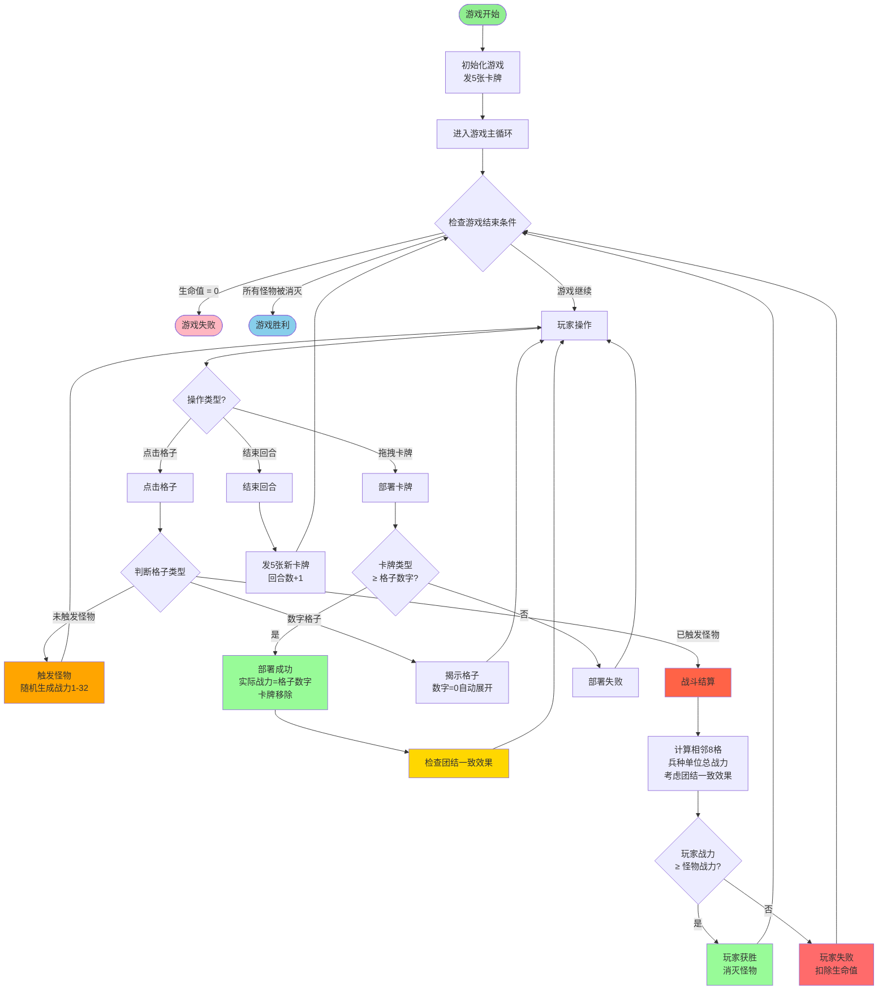
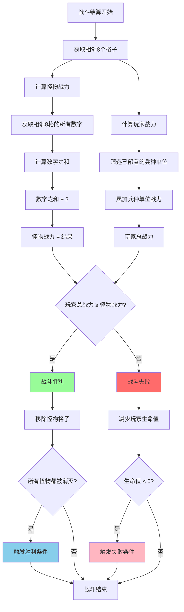
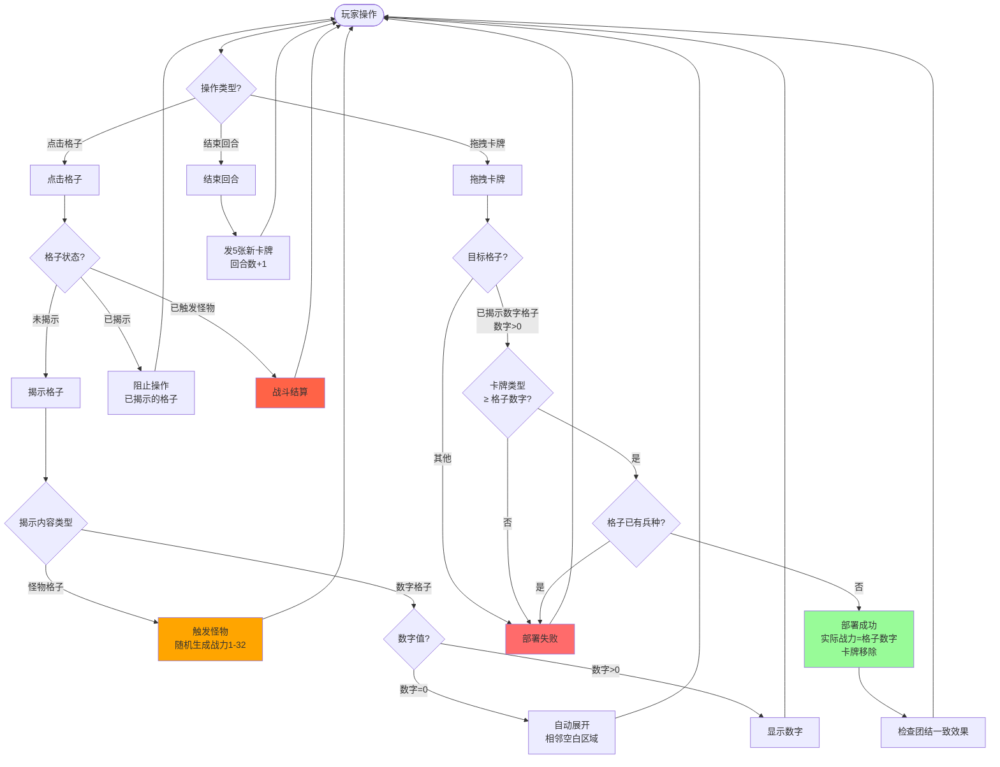
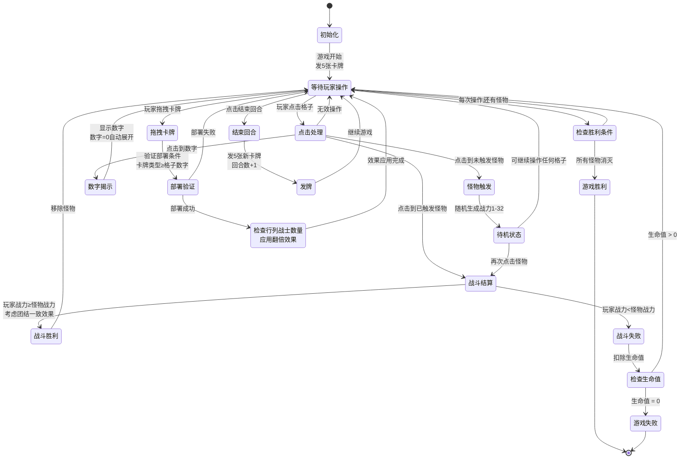

# 游戏流程图

## 设计说明

### 怪物战力计算规则

**怪物战斗力 = 使用正态分布随机生成（1-32，均值16，标准差8）**

这个设计的目的：
1. **随机性**：增加游戏的随机性和挑战性，每次战斗都有不同的难度
2. **策略性**：玩家需要在怪物待机期间，合理部署兵种来应对随机生成的怪物战力
3. **风险与收益**：玩家需要权衡是否立即战斗，还是先准备更多战力

### 战斗机制说明

- **怪物战力**：使用正态分布随机生成（1-32），在触发时确定
- **玩家战力**：基于相邻8格中玩家已部署的兵种单位总战力（考虑团结一致效果）
- **触发机制**：点击怪物后进入待机状态，再次点击进行战斗结算
- **待机期间**：玩家可以继续操作任何格子（没有位置限制）
- **战斗结算**：再次点击待机状态的怪物时，立即进行战斗结算

### 卡牌系统

- **发牌机制**：每回合结束时发5张随机卡牌
- **手牌上限**：手牌最大10张
- **部署规则**：卡牌类型必须 >= 数字格子的数字才能部署，实际战力 = 格子数字
- **兵种战力**：实际战力 = 格子数字（高数值卡牌会降低到格子数值）

### 回合系统

- **回合流程**：玩家操作 → 点击"结束回合" → 发新卡牌 → 回合数+1
- **操作类型**：点击格子（揭示/触发怪物/战斗）、拖拽卡牌（部署）、结束回合

### 团结一致效果

- **触发条件**：当一行或一列有3个或以上战士（类型1）时
- **效果**：这些战士获得战力翻倍效果（1次翻倍=2倍，2次翻倍=4倍）
- **叠加**：如果战士同时满足行和列条件，可以获得2次效果（4倍战力）

## 核心游戏流程

## 战斗结算详细流程

## 玩家操作流程

## 游戏状态管理

