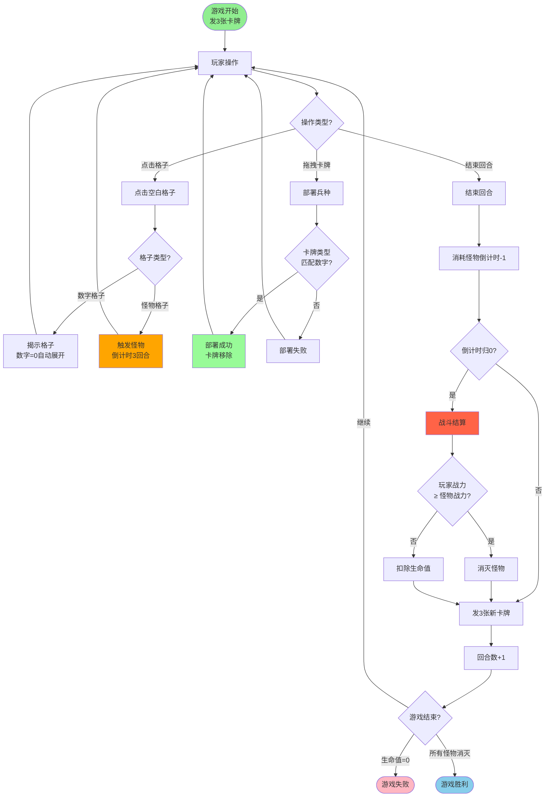

# 魔法军团：地雷战场 - 游戏规则书

## 📖 游戏概述

### 游戏目标

在战场上，你需要：
- **消灭所有怪物**：找出并击败所有隐藏的怪物，获得胜利
- **保护自己**：避免因战力不足而失败，保持生命值大于0

### 核心概念

- **数字格子**：显示数字（0-8），数字表示相邻8格中的怪物数量（经典扫雷机制）
- **怪物格子**：隐藏的怪物，点击后会触发战斗倒计时
- **卡牌系统**：每回合发3张卡牌，手牌最大10张，通过拖拽卡牌部署兵种
- **回合系统**：玩家需要主动点击"结束回合"按钮来结束回合
- **兵种部署**：在数字格子上部署匹配的兵种卡牌，增加你的战力
- **战斗系统**：通过战力对比来决定战斗胜负

---

## 🎮 基础规则

### 如何开始

1. 游戏开始时，所有格子都是隐藏状态
2. 游戏开始时，系统会发给你3张随机卡牌
3. 点击任意空白格子开始探索
4. 点击"结束回合"按钮来结束当前回合

### 点击格子的结果

**点击空白格子后，会出现两种情况：**

#### 情况1：数字格子
- 显示数字（0-8）
- **数字含义**：表示相邻8格中的怪物数量（经典扫雷机制）
- **特殊机制**：如果数字为0，会自动展开所有相邻的空白格子（数字为0），直到遇到数字>0的格子或怪物格子
- **部署限制**：只能部署与数字匹配的兵种卡牌（例如：数字3的格子只能部署类型3的卡牌）

#### 情况2：怪物格子
- 触发怪物战斗
- 开始回合倒计时（初始3回合）
- 怪物战力在触发时计算：相邻8格数字之和 ÷ 2

---

## ⚔️ 战斗系统

### 怪物战力计算

**怪物战斗力 = 相邻8个格子的数字之和 ÷ 2**

**重要说明：**
- 怪物战力是**固定值**，在怪物被触发时就已确定
- 计算基于相邻8格的所有数字（无论你是否已揭示）
- 这个设计让你即使没有完全揭露所有数字，也有机会战胜怪物

### 玩家战力计算

**玩家战力 = 相邻8格中已部署的兵种单位总战力**

- 只有**已部署兵种**的格子才计入战力
- 数字格子本身不算战力，必须部署兵种才有效

### 倒计时机制

1. **触发怪物**：点击怪物格子后，开始回合倒计时（初始3回合）
2. **倒计时类型**：是回合数倒计时，不是时间倒计时
3. **倒计时消耗**：每次点击"结束回合"按钮时，所有激活怪物的倒计时回合-1
4. **倒计时期间**：
   - 你可以继续操作任何格子（没有位置限制）
   - 可以继续揭示格子
   - 可以在数字格子上部署兵种
   - 可以继续获得新卡牌（每回合发3张）
5. **倒计时结束**：当怪物倒计时回合数归0时，在下次"结束回合"时自动进行战斗结算

### 战斗结算

倒计时结束时，系统会：
1. 计算怪物战力（相邻8格数字之和 ÷ 2）
2. 计算你的战力（相邻8格已部署兵种总战力）
3. 进行对比：
   - **你的战力 ≥ 怪物战力** → 战斗胜利，怪物被消灭
   - **你的战力 < 怪物战力** → 战斗失败，扣除生命值

---

## 👥 卡牌与兵种部署

### 卡牌系统

- **发牌机制**：每回合结束时会发3张随机卡牌
- **手牌上限**：手牌最大数量为10张，达到上限后不再发牌
- **卡牌类型**：卡牌类型为1-8，对应8种职业兵种
- **卡牌战力**：卡牌的战力 = 卡牌类型（例如：类型3的卡牌战力为3）

### 如何部署兵种

1. **前提条件**：格子必须是已揭示的数字格子
2. **匹配规则**：卡牌类型必须与数字格子的数字**完全匹配**
   - 例如：数字3的格子只能部署类型3的卡牌
3. **部署方式**：
   - 从手牌区域拖拽卡牌
   - 拖到匹配的数字格子上
   - 释放鼠标完成部署
4. **部署效果**：
   - 该格子获得兵种战力（战力 = 卡牌类型）
   - 卡牌从手牌中移除
   - 部署不消耗回合数（但需要等待回合结束才能获得新卡牌）

### 回合系统

- **回合流程**：
  1. 玩家进行操作（点击格子、部署兵种）
  2. 点击"结束回合"按钮
  3. 系统消耗所有激活怪物的倒计时回合（-1）
  4. 系统发3张新卡牌（如果手牌未满）
  5. 回合数+1
  6. 如果怪物倒计时归0，进行战斗结算

### 兵种类型（简要）

| 类型 | 职业 | 战力 | 特点 |
|------|------|------|------|
| 1 | 战士 | 1 | 近战肉盾，血量高 |
| 2 | 弓箭手 | 2 | 远程输出，攻击力中等 |
| 3 | 法师 | 3 | 魔法攻击，攻击力高但血量低 |
| 4 | 圣骑士 | 4 | 治疗+防御，全能型 |
| 5 | 盗贼 | 5 | 高暴击，闪避能力强 |
| 6 | 德鲁伊 | 6 | 召唤+自然魔法，平衡型 |
| 7 | 龙骑士 | 7 | 飞行单位，全属性优秀 |
| 8 | 大法师 | 8 | 终极魔法，范围攻击 |

**注意**：兵种战力 = 类型值（简化设计）

---

## 🏁 游戏结束条件

### 胜利条件

**所有怪物被消灭** → 游戏胜利！

### 失败条件

**生命值归零** → 游戏失败

- 每次战斗失败会扣除生命值
- 生命值为0时游戏结束

---

## 💡 策略提示

### 倒计时期间的策略

当怪物被触发后，你有以下选择：

1. **保守策略**：
   - 不揭示更多格子
   - 依靠已部署的兵种战力
   - 快速结束回合，让倒计时自然消耗
   - 适合：已部署兵种战力足够的情况

2. **积极策略**：
   - 揭示怪物周围的格子，寻找高数字
   - 在数字格子上部署匹配的兵种卡牌
   - 等待获得更多卡牌后再结束回合
   - 适合：当前战力不足，需要增加战力的情况

### 风险与收益权衡

**需要考虑的因素：**
- 怪物倒计时剩余回合数
- 当前已部署的兵种战力
- 手牌中是否有匹配的卡牌
- 相邻格子可能隐藏的数字
- 是否需要等待新卡牌

**建议：**
- 如果战力差距不大，优先部署已有数字格子的兵种
- 如果战力差距较大，考虑揭示更多格子寻找高数字
- 注意手牌管理，避免手牌满10张后无法获得新卡牌
- 合理规划回合，在倒计时结束前完成部署

---

## 📊 核心玩法流程图

---

## ❓ 常见问题

### Q: 怪物战力会变化吗？
A: 不会。怪物战力在触发时就已确定，等于相邻8格数字之和的一半。

### Q: 倒计时期间可以操作其他格子吗？
A: 可以。倒计时期间没有操作限制，你可以操作任何格子。

### Q: 数字格子的数字代表什么？
A: 数字表示相邻8格中的怪物数量（经典扫雷机制）。但部署兵种时，卡牌类型必须与数字匹配（例如：数字3的格子只能部署类型3的卡牌）。

### Q: 如何获得新卡牌？
A: 每回合结束时，系统会自动发3张随机卡牌。手牌最大10张，达到上限后不再发牌。

### Q: 部署兵种会消耗回合数吗？
A: 不会。部署兵种不消耗回合数，但需要点击"结束回合"才能获得新卡牌。

### Q: 倒计时是什么类型的？
A: 是回合数倒计时，不是时间倒计时。每次点击"结束回合"时，所有激活怪物的倒计时回合-1。

### Q: 如何知道怪物相邻格子的数字？
A: 需要主动点击揭示。倒计时期间可以揭示相邻格子，但会消耗回合数。

### Q: 战斗失败会怎样？
A: 扣除生命值。如果生命值归零，游戏失败。

---

**祝你在战场上取得胜利！** 🎮⚔️
