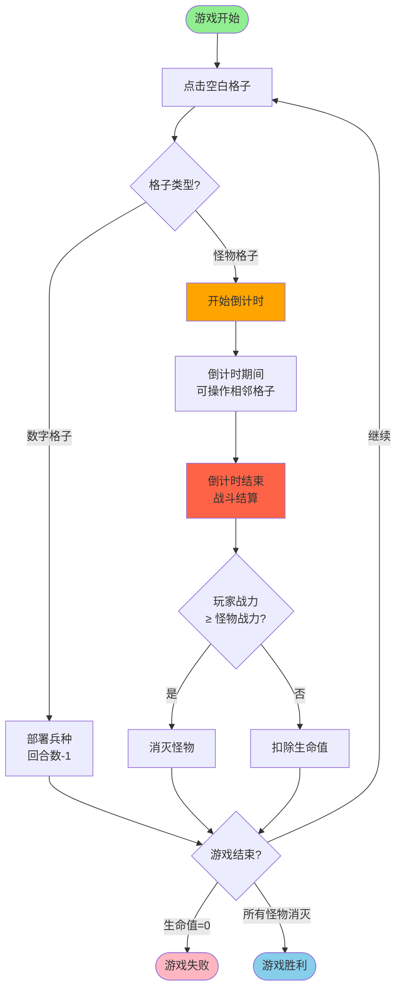

# 魔法军团：地雷战场 - 游戏规则书

## 📖 游戏概述

### 游戏目标

在战场上，你需要：
- **消灭所有怪物**：找出并击败所有隐藏的怪物，获得胜利
- **保护自己**：避免因战力不足而失败，保持生命值大于0

### 核心概念

- **数字格子**：显示数字（1-8），代表可以部署的职业兵种类型
- **怪物格子**：隐藏的怪物，点击后会触发战斗倒计时
- **兵种部署**：在数字格子上部署对应的职业兵种，增加你的战力
- **战斗系统**：通过战力对比来决定战斗胜负

---

## 🎮 基础规则

### 如何开始

1. 游戏开始时，所有格子都是隐藏状态
2. 点击任意空白格子开始探索
3. 每次操作会消耗1回合数

### 点击格子的结果

**点击空白格子后，会出现两种情况：**

#### 情况1：数字格子
- 显示数字（1-8）
- 数字代表可以部署的职业兵种类型
- 你可以在该格子上部署对应的兵种

#### 情况2：怪物格子
- 触发怪物战斗
- 开始回合倒计时
- 倒计时期间，你只能操作该怪物相邻的格子

---

## ⚔️ 战斗系统

### 怪物战力计算

**怪物战斗力 = 相邻8个格子的数字之和 ÷ 2**

**重要说明：**
- 怪物战力是**固定值**，在怪物被触发时就已确定
- 计算基于相邻8格的所有数字（无论你是否已揭示）
- 这个设计让你即使没有完全揭露所有数字，也有机会战胜怪物

### 玩家战力计算

**玩家战力 = 相邻8格中已部署的兵种单位总战力**

- 只有**已部署兵种**的格子才计入战力
- 数字格子本身不算战力，必须部署兵种才有效

### 倒计时机制

1. **触发怪物**：点击怪物格子后，开始倒计时
2. **倒计时期间**：
   - 你**只能操作**该怪物相邻的8个格子
   - 可以继续揭示相邻的格子
   - 可以在相邻的数字格子上部署兵种
   - 每次操作仍会消耗回合数
3. **倒计时结束**：自动进行战斗结算

### 战斗结算

倒计时结束时，系统会：
1. 计算怪物战力（相邻8格数字之和 ÷ 2）
2. 计算你的战力（相邻8格已部署兵种总战力）
3. 进行对比：
   - **你的战力 ≥ 怪物战力** → 战斗胜利，怪物被消灭
   - **你的战力 < 怪物战力** → 战斗失败，扣除生命值

---

## 👥 兵种部署

### 如何部署兵种

1. 点击已揭示的**数字格子**
2. 将对应的兵种拖入该格子
3. 部署成功，该格子获得兵种战力
4. 消耗1回合数

### 兵种类型（简要）

| 数字 | 职业 | 特点 |
|------|------|------|
| 1 | 战士 | 近战肉盾，血量高 |
| 2 | 弓箭手 | 远程输出，攻击力中等 |
| 3 | 法师 | 魔法攻击，攻击力高但血量低 |
| 4 | 圣骑士 | 治疗+防御，全能型 |
| 5 | 盗贼 | 高暴击，闪避能力强 |
| 6 | 德鲁伊 | 召唤+自然魔法，平衡型 |
| 7 | 龙骑士 | 飞行单位，全属性优秀 |
| 8 | 大法师 | 终极魔法，范围攻击 |

---

## 🏁 游戏结束条件

### 胜利条件

**所有怪物被消灭** → 游戏胜利！

### 失败条件

**生命值归零** → 游戏失败

- 每次战斗失败会扣除生命值
- 生命值为0时游戏结束

---

## 💡 策略提示

### 倒计时期间的策略

当怪物被触发后，你有两个选择：

1. **保守策略**：
   - 不消耗回合数去揭示更多格子
   - 依靠已部署的兵种战力
   - 适合：已部署兵种战力足够的情况

2. **积极策略**：
   - 消耗回合数揭示怪物相邻的格子
   - 在数字格子上部署更多兵种
   - 适合：当前战力不足，需要增加战力的情况

### 风险与收益权衡

**需要考虑的因素：**
- 倒计时剩余时间
- 当前已部署的兵种战力
- 相邻格子可能隐藏的数字
- 剩余的回合数

**建议：**
- 如果战力差距不大，优先部署已有数字格子的兵种
- 如果战力差距较大，考虑揭示更多格子寻找高数字
- 注意回合数消耗，避免过度操作导致其他区域无法探索

---

## 📊 核心玩法流程图

---

## ❓ 常见问题

### Q: 怪物战力会变化吗？
A: 不会。怪物战力在触发时就已确定，等于相邻8格数字之和的一半。

### Q: 倒计时期间可以操作其他格子吗？
A: 不可以。倒计时期间只能操作触发怪物的相邻8个格子。

### Q: 数字格子的数字代表什么？
A: 数字代表可以部署的职业兵种类型（1-8对应8种职业），数字越大，兵种越强。

### Q: 如何知道怪物相邻格子的数字？
A: 需要主动点击揭示。倒计时期间可以揭示相邻格子，但会消耗回合数。

### Q: 战斗失败会怎样？
A: 扣除生命值。如果生命值归零，游戏失败。

---

**祝你在战场上取得胜利！** 🎮⚔️
